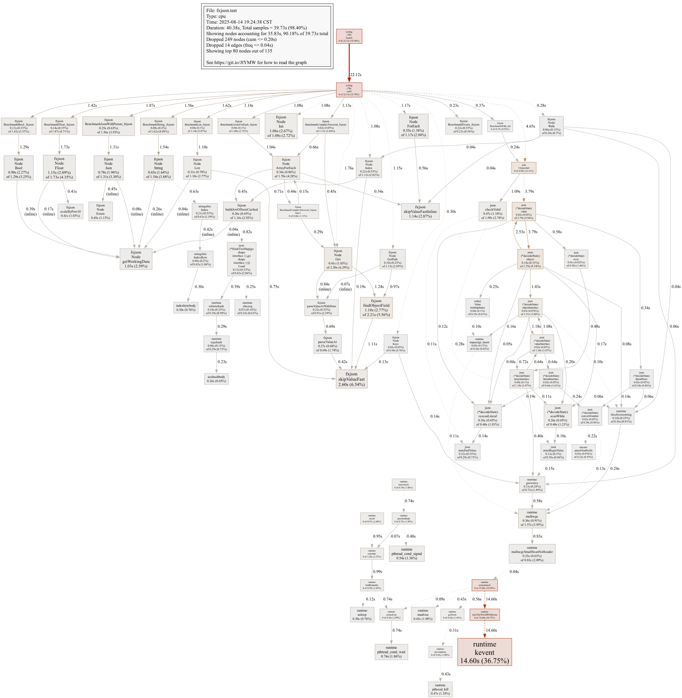

# fxjson

一个零分配、高性能的 Go 语言 JSON 解析器，聚焦**快速路径访问**与**极低内存开销**。

> 目标：在保持 API 易用的同时，压低延迟与分配，适配高 QPS、低抖动场景。

---

## ✨ 特性

* **0 分配**：`Get` / `GetPath` / `Len` / `Index` 等核心路径零分配。
* **值接收器统一**：遵循 Go 规范，避免值/指针混用导致的语义歧义与逃逸。
* **路径直达**：不构建中间树，按字节流直扫，跳过非目标字段。
* **特化数值解析**：手写 `Int/Uint/Float/Bool`，不依赖 `strconv`，调用栈极短。
* **数组下标 O(1)**：基于 `(data pointer + slice range)` 的全局无锁缓存，重复索引极快。

---

## 🚀 安装

```bash
go get github.com/icloudza/fxjson
```

---

## 🔧 快速开始

```go
package main

import (
  "fmt"
  "github.com/icloudza/fxjson"
)

func main() {
  b := []byte(`{"data":{"user":{"name":"Alice","age":30,"scores":[99,88,77]}}}`)

  n := fxjson.FromBytes(b)
  name := n.Get("data").Get("user").Get("name").String() // "Alice"
  fmt.Println("name:", name)
  age, _ := n.GetPath("data.user.age").Int() // 30
  fmt.Println("age:", age)
  s1 := n.GetPath("data.user.scores").Index(1).NumStr() // "88"
  fmt.Println("s1:", s1)
  ln := n.GetPath("data.user.scores").Len() // 3
  fmt.Println("ln:", ln)
  keys := n.Get("data").Get("user").Keys() // [][]byte{"name","age","scores"}
  for i, k := range keys {
    fmt.Printf("user index %d %s \n", i, string(k))
  }
}

//结果输出：
//name: Alice
//age: 30
//s1: 88
//ln: 3
//user index 0 name
//user index 1 age
//user index 2 scores 
```

---

## 📊 基准（Apple M4 Pro）

> 命令：`go test -bench . -benchmem -cpuprofile=cpu.out`

| Benchmark        | fxjson ns/op | fxjson B/op | fxjson allocs/op | gjson ns/op | gjson B/op | gjson allocs/op |
|------------------|--------------|-------------|------------------|-------------|------------|-----------------|
| BenchmarkGet     | 22.44        | 0           | 0                | 45.60       | 8          | 1               |
| BenchmarkGetPath | 92.77        | 0           | 0                | 138.5       | 5          | 1               |
| BenchmarkInt     | 14.84        | 0           | 0                | 9.134       | 0          | 0               |
| BenchmarkFloat   | 6.684        | 0           | 0                | 1.893       | 0          | 0               |
| BenchmarkBool    | 1.788        | 0           | 0                | 1.878       | 0          | 0               |
| BenchmarkString  | 0.9925       | 0           | 0                | 2.004       | 0          | 0               |
| BenchmarkNumStr  | 0.8289       | 0           | 0                | 0.2287      | 0          | 0               |
| BenchmarkLen     | 18.57        | 0           | 0                | 130.6       | 560        | 3               |
| BenchmarkKeys    | 114.7        | 168         | 3                | 213.1       | 944        | 2               |
| BenchmarkIndex   | 14.00        | 0           | 0                | 0.2255      | 0          | 0               |
| BenchmarkExists  | 0.2261       | 0           | 0                | 1.301       | 0          | 0               |
| BenchmarkIsNull  | 0.2247       | 0           | 0                | 0.2266      | 0          | 0               |
| BenchmarkDecode  | 129.8        | 368         | 5                | 108.5       | 0          | 0               |

### 火焰图（pprof）

> 已生成：`flame.png`



#### 复现命令

```bash
# 运行基准并产出 CPU Profile
go test -bench . -benchmem -cpuprofile=cpu.out

# 生成 SVG（可读性最好）
go tool pprof -svg ./fxjson.test cpu.out > flame.svg

# 需要 PNG/JPG 时：
# 1) Go 1.22+ 试试 -png（若支持）
# go tool pprof -png ./fxjson.test cpu.out > flame.png
# 2) 或者用 ImageMagick 转换
# convert flame.svg flame.png

# Web 界面（交互查看）
go tool pprof -http=:8080 ./fxjson.test cpu.out
```

---

## 🆚 与 gjson 的差异亮点

* **GC 噪音更低**：核心 API 0 alloc，火焰图几乎看不到 `mallocgc`/`makeslice`。
* **栈更浅，热点更集中**：`findObjectField` / `skipValueFast` 等成为单点热点，易于继续优化。
* **路径解析特化**：`GetPath` 直扫字节流，少通用分支；复杂对象也能快速跳值。
* **整数/浮点解析自研**：不走 `strconv`，短路径、高吞吐。
* **Index O(1)**：对同一数组多次索引，吞吐显著优于通用遍历。

> 适用：API 网关、日志/埋点采集、实时风控、撮合/竞价等延迟敏感业务。

---

## 📚 API 速览

```go
n := fxjson.FromBytes(data)

// 取字段 / 路径
n.Get("data")
n.GetPath("a.b[3].c")

// 数组
n.Get("arr").Len()
n.Get("arr").Index(0)

// 基本类型
n.Get("s").String()
n.Get("i").Int()
n.Get("u").Uint()
n.Get("f").Float()
n.Get("b").Bool()

// 其他
n.Exists()
n.IsNull()
n.NumStr()   // 数字原文字符串（零分配）
n.Raw()      // 原始切片视图（零拷贝）

// 解码为 any（快速/简易）：
var v any
_ = n.Decode(&v)
```

---

## ⚠️ 注意事项

* 约定输入为**合法 JSON**；解析器按高性能路径编写，不做重型容错。
* 全局数组下标缓存使用 `sync.Map`，Key 为 `(data pointer + range)`；
  适合长生命周期的原始字节复用场景（日志批/批量处理）。
* 统一值接收器：不修改 `Node` 自身状态，可无脑链式调用与并发读。

---

## 📦 兼容性
* Go 1.21+

---

## 📄 许可

MIT
